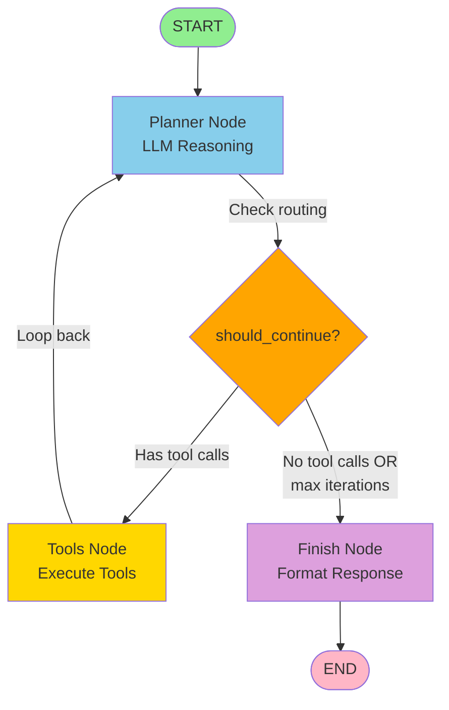

# Autonomous Scheduling Agent Implementation Plan

**Version**: 1.0  
**Date**: January 23, 2026  
**Status**: Approved - Ready for Implementation

---

## Table of Contents

1. [Executive Summary](#executive-summary)
2. [Design Decisions](#design-decisions)
3. [Architecture Overview](#architecture-overview)
4. [State Management](#state-management)
5. [Tool Suite](#tool-suite)
6. [Agent Graph Structure](#agent-graph-structure)
7. [Cost Optimization](#cost-optimization)
8. [Implementation Roadmap](#implementation-roadmap)
9. [API Changes](#api-changes)
10. [Success Criteria](#success-criteria)
11. [Open Questions](#open-questions)

---

## Executive Summary

### Goal
Transform the current single-shot `build_schedule()` chain into an autonomous LangGraph agent that iteratively builds TV schedules for Tunarr channels, making intelligent decisions about content placement while respecting user constraints and pre-scheduled content.

### Key Capabilities
- **Autonomous scheduling**: Agent reasons about what to schedule and when
- **Iterative refinement**: Loops until schedule meets quality criteria or iteration limit
- **Gap filling**: Works with partially-filled schedules, preserving pre-scheduled slots
- **Natural language constraints**: Parses user instructions like "play random sitcoms in the morning"
- **Cost tiering**: Supports economy/balanced/premium modes for different budget needs
- **Reasoning transparency**: Returns summary of key decisions for user review

### Difficulty Assessment
**⭐⭐⭐ Medium** - Achievable in 2-3 weeks with existing LangChain/Python skills

### Timeline
- **MVP (Week 1)**: Basic working agent with core tools
- **Production-Ready (Week 2-3)**: Cost optimization, robustness, integration testing

---

## Design Decisions

### 1. Slot Management Strategy
**Decision**: Hybrid approach with user-defined and agent-created slots

**Rationale**: Maximum flexibility while maintaining structure

**Implementation**:
```python
class ScheduleRequest(BaseModel):
    channel: Channel
    media: list[MediaItem]
    user_instructions: str | None
    scheduling_window_days: int = 7
    preferred_slots: list[str] | None = None  # e.g., ["08:00", "12:00", "18:00"]
    daily_slots: list[DailySlot] = Field(default_factory=list)  # Pre-filled
    start_date: datetime  # Explicit date range start
    end_date: datetime | None = None  # Calculated from start + window_days if None
    cost_tier: Literal["economy", "balanced", "premium"] = "balanced"
    max_iterations: int = 50
    quality_threshold: float = 0.7
    debug: bool = False
```

**Behavior**:
- Agent NEVER modifies/removes existing `daily_slots`
- Uses `preferred_slots` as hints for new slot boundaries
- Creates new slots with appropriate boundaries when filling gaps
- Aims to minimize filler content (prefer tighter scheduling over large gaps)

**Example Workflow**:
```
Input:
  - user_instructions: "Weekday mornings: random sitcoms. 3-10 PM: Modern Family, 
                        30 Rock, Parks & Rec. Nights: comedy movies."
  - daily_slots: [
      {start_time: "2026-02-01 17:00", end_time: "2026-02-01 18:00", media_id: "frasier-s01"},
      {start_time: "2026-02-01 18:00", end_time: "2026-02-01 19:00", media_id: "seinfeld-s02"}
    ]

Agent Actions:
  1. Parse constraints from user_instructions
  2. Identify gaps: before 17:00, 19:00-22:00, after 22:00
  3. Fill morning (8:00-15:00) with random sitcom slots
  4. Fill 15:00-17:00 with allowed shows (Modern Family, etc.)
  5. SKIP 17:00-19:00 (pre-scheduled)
  6. Fill 19:00-22:00 with allowed shows
  7. Fill 22:00+ with comedy movies
```

### 2. Content Scheduling Granularity
**Decision**: Schedule media items (not specific episodes), except for movies

**Rationale**: Matches typical TV scheduling practice; reduces complexity

**Implementation**:
```python
class DailySlot(BaseModel):
    start_time: datetime
    end_time: datetime
    media_id: str | None  # Can be:
                          # - "random:sitcom" (category)
                          # - "series:friends" (specific show, random episodes)
                          # - "movie:the-matrix" (specific movie)
    media_selection_strategy: Literal["random", "sequential", "specific"] = "random"
    category_filters: list[str] = Field(default_factory=list)  # e.g., ["comedy", "sitcom"]
    notes: list[str] = Field(default_factory=list)
```

**Content Selection Examples**:
- "Random sitcoms": `media_id="random:sitcom"`, `category_filters=["sitcom"]`
- "Friends episodes": `media_id="series:friends"`, `strategy="random"`
- "The Matrix": `media_id="movie:the-matrix"`, `strategy="specific"`

**Note**: Specific episode selection happens downstream in tunarr-scheduler, not in this agent.

### 3. Single-Channel Scheduling
**Decision**: One channel per agent invocation

**Rationale**: 
- Simpler state management
- Easier to reason about constraints
- Cross-channel coordination adds significant complexity with minimal benefit
- Channels can be scheduled independently in parallel if needed

### 4. Reasoning Summary Format
**Decision**: Return structured reasoning summary with key decisions

**Response Structure**:
```python
class ReasoningSummary(BaseModel):
    total_iterations: int
    key_decisions: list[str]  # 5-10 high-level choices
    constraints_applied: list[str]  # Parsed from user_instructions
    completion_status: Literal["complete", "partial", "failed"]
    unfilled_slots_count: int
    quality_score: float
    cost_estimate: dict  # {"llm_calls": 42, "tokens": 50000, "estimated_cost_usd": 0.025}

class ScheduleResponse(BaseModel):
    overview: str
    reasoning_summary: ReasoningSummary
    weekly_plan: list[str] = Field(default_factory=list)
    daily_slots: list[DailySlot] = Field(default_factory=list)
```

**Reasoning Capture Strategy**:
- Agent logs "key moments" to separate list during execution
- At finish, summarize top 5-10 most important decisions
- Include constraint parsing results
- Track quality metrics and completion status

### 5. Constraint Parsing Strategy
**Decision**: Separate LLM-powered constraint parsing tool (Option A)

**Rationale**:
- Cleaner separation of concerns
- Can use cheaper model (economy tier) for parsing
- Produces structured constraints for validation
- Results can be cached/reviewed before scheduling starts

**Constraint Schema**:
```python
class TimeWindow(BaseModel):
    days: list[Literal["monday", "tuesday", "wednesday", "thursday", 
                       "friday", "saturday", "sunday"]] | Literal["weekdays", "weekends", "all"]
    start_time: str  # "08:00" or fuzzy "morning"
    end_time: str    # "15:00" or fuzzy "afternoon"

class ContentRule(BaseModel):
    allowed_media: list[str] | Literal["random"]  # Media IDs or "random"
    required_categories: list[str] = Field(default_factory=list)  # ["comedy", "sitcom"]
    excluded_categories: list[str] = Field(default_factory=list)  # ["horror", "drama"]
    time_windows: list[TimeWindow]

class SchedulingConstraints(BaseModel):
    content_rules: list[ContentRule]
    repetition_rules: dict = Field(default_factory=dict)  # {"min_hours_between_repeats": 48}
    quality_preferences: dict = Field(default_factory=dict)  # {"minimize_filler": True}
```

**Parsing Tool**:
```python
@tool
def parse_scheduling_constraints(user_instructions: str) -> SchedulingConstraints:
    """Parse natural language instructions into structured constraints.
    
    Example:
    Input: "Weekday mornings: random sitcoms. 3-10 PM: Modern Family, 30 Rock. 
            No repeats within 48 hours."
    
    Output: SchedulingConstraints(
        content_rules=[
            ContentRule(
                required_categories=["sitcom"],
                time_windows=[TimeWindow(days="weekdays", start_time="06:00", end_time="15:00")]
            ),
            ContentRule(
                allowed_media=["modern-family", "30-rock"],
                time_windows=[TimeWindow(days="all", start_time="15:00", end_time="22:00")]
            )
        ],
        repetition_rules={"min_hours_between_repeats": 48}
    )
    """
    # Uses LLM with structured output
    pass
```

### 6. Schedule Window Format
**Decision**: Explicit date range passed by caller

**Format**: 
- `start_date: datetime` (required)
- `end_date: datetime | None` (calculated from `start_date + scheduling_window_days` if None)
- Both in server local time (no timezone conversion)

**Example**:
```python
ScheduleRequest(
    start_date=datetime(2026, 2, 2),  # Sunday
    scheduling_window_days=7,
    # Implicitly: end_date = 2026-02-09 (next Sunday)
)
```

### 7. Filler Content Handling
**Decision**: Agent is filler-agnostic, aims to minimize gaps

**Behavior**:
- Agent schedules media in time slots
- Doesn't explicitly model filler content
- Aims to minimize gap duration (prefer 5 min gap over 20 min)
- Downstream system (ErsatzTV/Tunarr) handles actual filler insertion

**Slot Duration Strategy**:
```python
# If scheduling 42-minute show at 8:00 with next preferred slot at 9:00:
# Option A: Schedule 8:00-8:42, create next slot at 8:42 (0 filler)
# Option B: Schedule 8:00-9:00 (18 min filler - acceptable)
# Option C: Schedule 8:00-8:50, next at 8:50 (8 min filler - good balance)

# Agent prefers: Option A > Option C > Option B
```

### 8. Reasoning Delivery Method
**Decision**: Synchronous response with reasoning included

**Rationale**:
- Schedules generated days/weeks in advance (no urgency)
- Simpler implementation (no job queue needed)
- Reasoning immediately available for GUI display
- Can add async mode later if needed

**Timeout Handling**:
- Set reasonable FastAPI timeout (5 minutes)
- Agent max_iterations ensures it finishes in time
- If timeout occurs, return partial schedule + reasoning so far

### 9. Cost Tiering Strategy
**Decision**: Three tiers with model selection per operation

**Tiers**:

| Tier | Use Case | Primary Model | Secondary Model | Quality Threshold |
|------|----------|---------------|-----------------|-------------------|
| **Economy** | Budget-conscious, basic schedules | Deepseek/Ollama (local) | GPT-4o-mini (fallback) | 0.6 |
| **Balanced** | Default, good quality/cost ratio | GPT-4o-mini | - | 0.7 |
| **Premium** | High-stakes, complex schedules | GPT-4o-mini | GPT-4o (critical decisions) | 0.85 |

**Operation Assignments**:
```python
# Economy tier can use local models:
SIMPLE_OPERATIONS = [
    "parse_constraints",        # Structured extraction
    "identify_gaps",            # Rule-based
    "check_violations",         # Validation logic
    "format_schedule"           # Output formatting
]

# Requires GPT-4o-mini minimum:
COMPLEX_OPERATIONS = [
    "agent_reasoning",          # Main planning loop
    "suggest_media_for_slot",   # Content selection
    "evaluate_quality"          # Subjective assessment
]

# Premium tier only:
CRITICAL_OPERATIONS = [
    "resolve_constraint_conflict",  # Disambiguation
    "optimize_schedule"             # Major restructuring
]
```

### 10. Partial Schedule Handling
**Decision**: Idempotent gap-filling mode

**Behavior**:
- Agent detects existing `daily_slots` automatically
- Treats them as immutable (never modifies)
- Identifies unfilled time periods
- Fills gaps according to constraints
- Returns completion status

**Resume Workflow**:
```
Attempt 1: 
  Input: Empty schedule
  Output: 80% complete, 20 unfilled slots
  
Attempt 2:
  Input: Previous output with 80% filled
  Output: 95% complete, 5 unfilled slots
  
Attempt 3:
  Input: Previous output with 95% filled
  Output: 100% complete, 0 unfilled slots
```

**Completion Status**:
- `complete`: All time slots filled, meets quality threshold
- `partial`: Some slots filled, but gaps remain
- `failed`: Unable to make progress (e.g., insufficient content)

---

## Architecture Overview

### System Context

```
┌─────────────────────────────────────────────────────────────────┐
│                     Tunarr-Scheduler (Clojure)                  │
│                                                                   │
│  ┌──────────────┐      HTTP POST /schedule      ┌─────────────┐ │
│  │  Admin GUI   │ ────────────────────────────> │  Tunabrain  │ │
│  │              │                                │   Client    │ │
│  │  - Configure │ <──────────────────────────── │             │ │
│  │    prompts   │      ScheduleResponse          └─────────────┘ │
│  │  - Review    │      + reasoning summary                       │
│  │    reasoning │                                                │
│  └──────────────┘                                                │
└─────────────────────────────────────────────────────────────────┘
                                    │
                                    │ HTTP
                                    ▼
┌─────────────────────────────────────────────────────────────────┐
│                      Tunabrain (FastAPI)                         │
│                                                                   │
│  ┌──────────────────────────────────────────────────────────┐   │
│  │  POST /schedule                                          │   │
│  │    ├─> build_schedule()                                  │   │
│  │    │     └─> SchedulingAgent.invoke()                    │   │
│  │    │           ├─> Parse Constraints Tool                │   │
│  │    │           ├─> Agent Planning Loop ─┐                │   │
│  │    │           │     ├─> Reasoning       │                │   │
│  │    │           │     ├─> Tool Selection  │ (iterate)     │   │
│  │    │           │     └─> Observation  <──┘                │   │
│  │    │           ├─> Scheduling Tools                       │   │
│  │    │           │     ├─> analyze_media                    │   │
│  │    │           │     ├─> identify_gaps                    │   │
│  │    │           │     ├─> suggest_media                    │   │
│  │    │           │     ├─> fill_slot                        │   │
│  │    │           │     ├─> check_violations                 │   │
│  │    │           │     └─> evaluate_quality                 │   │
│  │    │           └─> Format Response                        │   │
│  │    └─> ScheduleResponse + ReasoningSummary               │   │
│  └──────────────────────────────────────────────────────────┘   │
│                                                                   │
│  ┌──────────────────────────────────────────────────────────┐   │
│  │  LLM Integration Layer                                   │   │
│  │    ├─> get_chat_model(complexity: str, tier: str)        │   │
│  │    │     ├─> "simple" + "economy" → Ollama/Deepseek      │   │
│  │    │     ├─> "medium" + "balanced" → GPT-4o-mini         │   │
│  │    │     └─> "high" + "premium" → GPT-4o                 │   │
│  └──────────────────────────────────────────────────────────┘   │
└─────────────────────────────────────────────────────────────────┘
```

### Agent Loop (ReAct Pattern)

```
START
  │
  ├─> [Parse Constraints Tool]
  │     ↓
  │   Structured constraints
  │     ↓
  ├─> [Initialize State]
  │     ↓
  ├─> [PLANNER NODE] ←──────────┐
  │     │                        │
  │     ├─> Reasoning            │
  │     │   "What should I do?"  │
  │     │                        │
  │     ├─> Action Selection     │
  │     │   "Use tool X"         │
  │     │                        │
  │     ├─> [TOOLS NODE]         │
  │     │     │                  │
  │     │     ├─> analyze_media  │
  │     │     ├─> identify_gaps  │
  │     │     ├─> suggest_media  │
  │     │     ├─> fill_slot      │
  │     │     ├─> check_violations
  │     │     └─> evaluate_quality
  │     │           ↓            │
  │     │       Observation      │
  │     │           ↓            │
  │     └─> [Continue?] ─────────┘
  │           │
  │         [Yes: iterations < max && quality < threshold]
  │           │
  │         [No: done]
  │           ↓
  └─> [FINISH NODE]
        ↓
      Format response + reasoning summary
        ↓
      END
```

---

## State Management

### SchedulingState TypedDict

```python
from typing import TypedDict, Annotated
from langgraph.graph import add_messages
from datetime import datetime

class SchedulingState(TypedDict):
    """Complete state tracked throughout scheduling process"""
    
    # === User Inputs (immutable) ===
    messages: Annotated[list, add_messages]  # LangGraph message history
    channel: Channel
    media_library: list[MediaItem]
    user_instructions: str | None
    scheduling_window_days: int
    start_date: datetime
    end_date: datetime
    preferred_slots: list[str] | None
    cost_tier: str  # "economy" | "balanced" | "premium"
    max_iterations: int
    quality_threshold: float
    
    # === Parsed Constraints (set by parse_constraints tool) ===
    constraints: SchedulingConstraints | None
    
    # === Working State (mutable) ===
    current_schedule: dict[str, list[DailySlot]]  # Key: "2026-02-01", Value: [slot, slot, ...]
    immutable_slots: set[str]  # Set of slot IDs that cannot be modified
    
    # === Analysis Cache (performance optimization) ===
    media_analysis: dict | None  # Results from analyze_media_distribution
    gap_analysis: list[dict] | None  # Current unfilled slots
    
    # === Control Flow ===
    iterations: int
    confidence_score: float  # 0.0 - 1.0
    completion_status: str  # "in_progress" | "complete" | "partial" | "failed"
    
    # === Reasoning Capture ===
    key_decisions: list[str]  # Accumulated during execution
    tool_calls_made: list[dict]  # For cost tracking
```

### State Initialization

```python
def initialize_state(request: ScheduleRequest) -> SchedulingState:
    """Create initial state from API request"""
    
    # Calculate end_date if not provided
    end_date = request.end_date or (
        request.start_date + timedelta(days=request.scheduling_window_days)
    )
    
    # Extract pre-scheduled slots and mark as immutable
    immutable_slots = set()
    current_schedule = defaultdict(list)
    
    for slot in request.daily_slots:
        day_key = slot.start_time.strftime("%Y-%m-%d")
        current_schedule[day_key].append(slot)
        immutable_slots.add(f"{day_key}:{slot.start_time.isoformat()}")
    
    return {
        "messages": [HumanMessage(content=format_initial_prompt(request))],
        "channel": request.channel,
        "media_library": request.media,
        "user_instructions": request.user_instructions,
        "scheduling_window_days": request.scheduling_window_days,
        "start_date": request.start_date,
        "end_date": end_date,
        "preferred_slots": request.preferred_slots,
        "cost_tier": request.cost_tier,
        "max_iterations": request.max_iterations,
        "quality_threshold": request.quality_threshold,
        "constraints": None,  # Filled by parse_constraints tool
        "current_schedule": dict(current_schedule),
        "immutable_slots": immutable_slots,
        "media_analysis": None,
        "gap_analysis": None,
        "iterations": 0,
        "confidence_score": 0.0,
        "completion_status": "in_progress",
        "key_decisions": [],
        "tool_calls_made": [],
    }
```

---

## Tool Suite

### Tool Design Principles
1. **Single Responsibility**: Each tool does one thing well
2. **Stateless**: Tools operate on passed state, don't maintain internal state
3. **Fast**: Most tools should complete in < 1 second
4. **Composable**: Agent can chain tools to solve complex problems

### Core Tools (7 total)

#### 1. parse_scheduling_constraints

```python
@tool
def parse_scheduling_constraints(
    user_instructions: str,
    scheduling_window_days: int,
    start_date: str,
) -> dict:
    """Parse natural language scheduling instructions into structured constraints.
    
    Args:
        user_instructions: Natural language like "Weekday mornings: sitcoms, 
                          3-10 PM: Modern Family/30 Rock, Nights: movies"
        scheduling_window_days: Number of days to schedule (affects weekday logic)
        start_date: ISO format date string for the schedule start
    
    Returns:
        Structured constraints as JSON matching SchedulingConstraints schema
    
    Examples:
        Input: "Weekday mornings play random sitcoms until 3 PM"
        Output: {
            "content_rules": [{
                "required_categories": ["sitcom"],
                "time_windows": [{
                    "days": "weekdays",
                    "start_time": "06:00",
                    "end_time": "15:00"
                }]
            }],
            "repetition_rules": {},
            "quality_preferences": {"minimize_filler": true}
        }
    """
    # Uses economy-tier LLM for structured extraction
    llm = get_chat_model(complexity="simple", tier=cost_tier)
    
    # Prompt with examples for few-shot learning
    parser = PydanticOutputParser(pydantic_object=SchedulingConstraints)
    prompt = ChatPromptTemplate.from_messages([
        ("system", CONSTRAINT_PARSING_SYSTEM_PROMPT),
        ("human", user_instructions)
    ])
    
    result = llm.invoke(prompt.format_messages())
    return parser.parse(result.content)
```

#### 2. analyze_media_distribution

```python
@tool
def analyze_media_distribution(
    media_library: list[dict],
    constraints: dict,
) -> dict:
    """Analyze available media content for scheduling feasibility.
    
    Args:
        media_library: List of MediaItem dicts with title, genres, duration, etc.
        constraints: Parsed scheduling constraints
    
    Returns:
        Analysis results including:
        - Total runtime available
        - Genre distribution
        - Duration statistics
        - Content gaps (e.g., "need more horror")
    
    Examples:
        Output: {
            "total_items": 150,
            "total_runtime_minutes": 8400,
            "genre_distribution": {"comedy": 50, "drama": 40, "horror": 10},
            "duration_stats": {"mean": 42, "min": 22, "max": 180},
            "content_gaps": ["Limited horror content for night slots"],
            "recommendations": ["Schedule allows 200 hours; library has 140 hours available"]
        }
    """
    # Mostly rule-based, but may use economy LLM for "content_gaps" narrative
    total_runtime = sum(m.get("duration_minutes", 0) for m in media_library)
    genres = defaultdict(int)
    durations = []
    
    for media in media_library:
        durations.append(media.get("duration_minutes", 0))
        for genre in media.get("genres", []):
            genres[genre] += 1
    
    # ... compute statistics ...
    
    # Use LLM to generate content_gaps and recommendations
    # based on constraints vs available content
    
    return {
        "total_items": len(media_library),
        "total_runtime_minutes": total_runtime,
        "genre_distribution": dict(genres),
        "duration_stats": {
            "mean": statistics.mean(durations),
            "median": statistics.median(durations),
            "min": min(durations),
            "max": max(durations),
        },
        "content_gaps": [...],  # Generated by LLM
        "recommendations": [...],  # Generated by LLM
    }
```

#### 3. identify_schedule_gaps

```python
@tool
def identify_schedule_gaps(
    current_schedule: dict[str, list[dict]],
    start_date: str,
    end_date: str,
    immutable_slots: list[str],
    preferred_slots: list[str] | None,
) -> list[dict]:
    """Find unfilled time periods in the schedule.
    
    Args:
        current_schedule: Dict mapping date strings to lists of DailySlot dicts
        start_date: ISO date string for schedule start
        end_date: ISO date string for schedule end
        immutable_slots: Slot IDs that cannot be modified
        preferred_slots: Optional list of preferred slot times (e.g., ["08:00", "12:00"])
    
    Returns:
        List of gaps with suggested slot boundaries
    
    Examples:
        Output: [
            {
                "date": "2026-02-01",
                "gap_start": "08:00",
                "gap_end": "17:00",
                "duration_minutes": 540,
                "suggested_slots": [
                    {"start": "08:00", "end": "12:00"},
                    {"start": "12:00", "end": "17:00"}
                ],
                "context": "Weekday morning, falls under 'random sitcoms' rule"
            },
            ...
        ]
    """
    # Rule-based algorithm, no LLM needed
    gaps = []
    current = datetime.fromisoformat(start_date)
    end = datetime.fromisoformat(end_date)
    
    while current < end:
        day_key = current.strftime("%Y-%m-%d")
        day_schedule = sorted(
            current_schedule.get(day_key, []),
            key=lambda s: s["start_time"]
        )
        
        # Find gaps between slots
        # If preferred_slots provided, align suggestions to those times
        # Otherwise, use media duration to suggest natural boundaries
        
        # ... gap detection logic ...
        
        current += timedelta(days=1)
    
    return gaps
```

#### 4. suggest_media_for_slot

```python
@tool
def suggest_media_for_slot(
    time_slot_start: str,
    time_slot_end: str,
    date: str,
    already_scheduled: list[str],
    available_media: list[dict],
    constraints: dict,
    context: str,
) -> dict:
    """Suggest best media item for a specific time slot using LLM reasoning.
    
    Args:
        time_slot_start: ISO time string (e.g., "08:00")
        time_slot_end: ISO time string (e.g., "09:00")
        date: ISO date string
        already_scheduled: List of media IDs already scheduled in current window
        available_media: Filtered list of MediaItem dicts that match constraints
        constraints: Parsed scheduling constraints
        context: Additional context (e.g., "weekday morning", "primetime")
    
    Returns:
        Suggested media selection with reasoning
    
    Examples:
        Output: {
            "media_id": "series:friends",
            "selection_strategy": "random",
            "category_filters": ["sitcom"],
            "confidence": 0.9,
            "reasoning": "Friends is a popular sitcom, fits weekday morning slot, 
                         hasn't been scheduled in past 48 hours"
        }
    """
    # Uses balanced-tier LLM for content reasoning
    llm = get_chat_model(complexity="medium", tier=cost_tier)
    
    # Filter media by constraints first
    eligible_media = filter_media_by_constraints(
        available_media, 
        constraints, 
        time_slot_start, 
        date
    )
    
    # Build prompt with context
    prompt = f"""
    You are scheduling content for a TV channel.
    
    Time slot: {date} {time_slot_start} - {time_slot_end}
    Context: {context}
    
    Constraints: {json.dumps(constraints, indent=2)}
    
    Already scheduled (avoid repeats): {already_scheduled[-20:]}
    
    Available media (top 20 by relevance):
    {format_media_for_prompt(eligible_media[:20])}
    
    Suggest the best media for this slot. Consider:
    - Time of day appropriateness
    - Content variety (avoid clustering similar shows)
    - Repetition rules
    - Flow and pacing
    
    Return JSON with: media_id, selection_strategy, category_filters, confidence, reasoning
    """
    
    result = llm.invoke(prompt)
    return json.loads(result.content)
```

#### 5. fill_time_slot

```python
@tool
def fill_time_slot(
    schedule: dict[str, list[dict]],
    date: str,
    start_time: str,
    end_time: str,
    media_id: str,
    selection_strategy: str,
    category_filters: list[str],
    notes: list[str],
) -> dict:
    """Add a media item to the schedule in a specific slot.
    
    Args:
        schedule: Current schedule dict
        date: ISO date string
        start_time: ISO time string
        end_time: ISO time string
        media_id: Media identifier (e.g., "series:friends", "movie:the-matrix")
        selection_strategy: "random" | "sequential" | "specific"
        category_filters: List of category tags
        notes: Optional notes for this slot
    
    Returns:
        Updated schedule dict
    
    Examples:
        Input: schedule={}, date="2026-02-01", start="08:00", end="09:00", 
               media_id="series:friends"
        Output: {
            "2026-02-01": [{
                "start_time": "2026-02-01T08:00:00",
                "end_time": "2026-02-01T09:00:00",
                "media_id": "series:friends",
                "media_selection_strategy": "random",
                "category_filters": [],
                "notes": []
            }]
        }
    """
    # Pure Python, no LLM
    day_key = date
    if day_key not in schedule:
        schedule[day_key] = []
    
    # Check for overlaps with existing slots
    new_slot_start = datetime.fromisoformat(f"{date}T{start_time}:00")
    new_slot_end = datetime.fromisoformat(f"{date}T{end_time}:00")
    
    for existing_slot in schedule[day_key]:
        existing_start = datetime.fromisoformat(existing_slot["start_time"])
        existing_end = datetime.fromisoformat(existing_slot["end_time"])
        
        if (new_slot_start < existing_end and new_slot_end > existing_start):
            raise ValueError(f"Slot overlaps with existing slot: {existing_slot}")
    
    # Add new slot
    schedule[day_key].append({
        "start_time": f"{date}T{start_time}:00",
        "end_time": f"{date}T{end_time}:00",
        "media_id": media_id,
        "media_selection_strategy": selection_strategy,
        "category_filters": category_filters,
        "notes": notes,
    })
    
    # Sort by start time
    schedule[day_key].sort(key=lambda s: s["start_time"])
    
    return schedule
```

#### 6. check_constraint_violations

```python
@tool
def check_constraint_violations(
    schedule: dict[str, list[dict]],
    constraints: dict,
    media_library: list[dict],
) -> list[str]:
    """Validate schedule against constraints and return violations.
    
    Args:
        schedule: Current schedule dict
        constraints: Parsed scheduling constraints
        media_library: Full media library for lookups
    
    Returns:
        List of violation descriptions (empty if all good)
    
    Examples:
        Output: [
            "Constraint violation: 'Friends' scheduled at 2026-02-01 08:00 and 2026-02-02 06:00 (only 22 hours apart, need 48)",
            "Constraint violation: Horror movie 'The Ring' scheduled at 2026-02-03 19:00, but horror not allowed before 22:00"
        ]
    """
    # Mostly rule-based, no LLM needed
    violations = []
    
    # Check repetition rules
    if "min_hours_between_repeats" in constraints.get("repetition_rules", {}):
        min_hours = constraints["repetition_rules"]["min_hours_between_repeats"]
        violations.extend(check_repetition_violations(schedule, min_hours))
    
    # Check content rules (categories allowed in time windows)
    for rule in constraints.get("content_rules", []):
        violations.extend(check_content_rule_violations(schedule, rule, media_library))
    
    return violations
```

#### 7. evaluate_schedule_quality

```python
@tool
def evaluate_schedule_quality(
    schedule: dict[str, list[dict]],
    constraints: dict,
    media_library: list[dict],
    evaluation_criteria: list[str],
) -> dict:
    """Score schedule quality on multiple dimensions using LLM judgment.
    
    Args:
        schedule: Current schedule dict
        constraints: Parsed scheduling constraints
        media_library: Full media library for context
        evaluation_criteria: List of criteria to evaluate 
                            (e.g., ["variety", "flow", "constraint_adherence", "coverage"])
    
    Returns:
        Quality scores and overall assessment
    
    Examples:
        Output: {
            "overall_score": 0.82,
            "dimension_scores": {
                "variety": 0.85,
                "flow": 0.80,
                "constraint_adherence": 1.0,
                "coverage": 0.75
            },
            "strengths": ["Good genre variety", "No constraint violations"],
            "weaknesses": ["25% of time slots still unfilled", "Clustering of similar shows on Wednesday"],
            "recommendations": ["Fill remaining gaps with available comedy content"]
        }
    """
    # Uses balanced-tier LLM for subjective quality assessment
    llm = get_chat_model(complexity="medium", tier=cost_tier)
    
    # Compute objective metrics first
    total_slots = count_total_possible_slots(schedule, constraints)
    filled_slots = count_filled_slots(schedule)
    coverage = filled_slots / total_slots if total_slots > 0 else 0
    
    violations = check_constraint_violations(schedule, constraints, media_library)
    constraint_adherence = 1.0 if not violations else max(0, 1.0 - len(violations) * 0.1)
    
    # Use LLM for subjective metrics (variety, flow)
    prompt = f"""
    Evaluate this TV schedule on the following criteria: {evaluation_criteria}
    
    Schedule summary:
    {format_schedule_for_evaluation(schedule)}
    
    Constraints:
    {json.dumps(constraints, indent=2)}
    
    Provide scores (0.0-1.0) for each criterion and overall assessment.
    Return JSON with: overall_score, dimension_scores, strengths, weaknesses, recommendations
    """
    
    result = llm.invoke(prompt)
    scores = json.loads(result.content)
    
    # Blend objective + subjective scores
    scores["dimension_scores"]["constraint_adherence"] = constraint_adherence
    scores["dimension_scores"]["coverage"] = coverage
    
    return scores
```

---

## Agent Graph Structure

### Graph Definition

```python
from langgraph.graph import StateGraph, START, END
from langgraph.prebuilt import ToolNode
from langgraph.checkpoint.sqlite import SqliteSaver

# Initialize tools
tools = [
    parse_scheduling_constraints,
    analyze_media_distribution,
    identify_schedule_gaps,
    suggest_media_for_slot,
    fill_time_slot,
    check_constraint_violations,
    evaluate_schedule_quality,
]

# Node implementations
def agent_planner(state: SchedulingState) -> dict:
    """Main reasoning node - LLM decides what to do next"""
    
    # Increment iteration counter
    state["iterations"] += 1
    
    # Get appropriate LLM based on cost tier
    llm = get_chat_model(
        complexity="medium", 
        tier=state["cost_tier"]
    ).bind_tools(tools)
    
    # Build system prompt with current state context
    system_prompt = build_scheduling_system_prompt(state)
    
    # Invoke LLM
    messages = [SystemMessage(content=system_prompt)] + state["messages"]
    response = llm.invoke(messages)
    
    # Track tool calls for cost estimation
    if hasattr(response, "tool_calls") and response.tool_calls:
        state["tool_calls_made"].extend(response.tool_calls)
    
    return {"messages": [response]}


def should_continue(state: SchedulingState) -> str:
    """Routing logic - decide next node"""
    
    # Safety: max iterations reached
    if state["iterations"] >= state["max_iterations"]:
        logger.warning(f"Max iterations ({state['max_iterations']}) reached")
        return "finish"
    
    last_message = state["messages"][-1]
    
    # Check if agent wants to use tools
    if hasattr(last_message, "tool_calls") and last_message.tool_calls:
        return "tools"
    
    # Agent decided to finish
    return "finish"


def finish_schedule(state: SchedulingState) -> dict:
    """Format final response with reasoning summary"""
    
    # Compute final quality score
    if state["current_schedule"]:
        quality_result = evaluate_schedule_quality(
            schedule=state["current_schedule"],
            constraints=state["constraints"],
            media_library=state["media_library"],
            evaluation_criteria=["variety", "flow", "constraint_adherence", "coverage"]
        )
        final_quality = quality_result["overall_score"]
    else:
        final_quality = 0.0
    
    # Determine completion status
    gaps = identify_schedule_gaps(
        current_schedule=state["current_schedule"],
        start_date=state["start_date"].isoformat(),
        end_date=state["end_date"].isoformat(),
        immutable_slots=list(state["immutable_slots"]),
        preferred_slots=state["preferred_slots"]
    )
    
    if not gaps:
        completion_status = "complete"
    elif state["current_schedule"]:
        completion_status = "partial"
    else:
        completion_status = "failed"
    
    # Build reasoning summary
    reasoning_summary = ReasoningSummary(
        total_iterations=state["iterations"],
        key_decisions=state["key_decisions"][-10:],  # Top 10 most recent
        constraints_applied=format_constraints_summary(state["constraints"]),
        completion_status=completion_status,
        unfilled_slots_count=len(gaps),
        quality_score=final_quality,
        cost_estimate=estimate_cost(state["tool_calls_made"])
    )
    
    # Generate overview and weekly plan
    overview = generate_overview(state["current_schedule"], state["channel"])
    weekly_plan = generate_weekly_plan(state["current_schedule"])
    
    # Flatten schedule to DailySlot list
    daily_slots = []
    for day_slots in state["current_schedule"].values():
        daily_slots.extend([
            DailySlot(**slot) for slot in day_slots
        ])
    
    # Return response components
    return {
        "overview": overview,
        "reasoning_summary": reasoning_summary,
        "weekly_plan": weekly_plan,
        "daily_slots": daily_slots,
    }


# Build the graph
def create_scheduling_agent() -> CompiledGraph:
    """Construct the scheduling agent graph"""
    
    workflow = StateGraph(SchedulingState)
    
    # Add nodes
    workflow.add_node("planner", agent_planner)
    workflow.add_node("tools", ToolNode(tools))
    workflow.add_node("finish", finish_schedule)
    
    # Add edges
    workflow.add_edge(START, "planner")
    workflow.add_conditional_edges(
        "planner",
        should_continue,
        {
            "tools": "tools",
            "finish": "finish"
        }
    )
    workflow.add_edge("tools", "planner")  # Loop back after tool execution
    workflow.add_edge("finish", END)
    
    # Compile with checkpointer for state persistence
    checkpointer = SqliteSaver.from_conn_string(":memory:")
    return workflow.compile(checkpointer=checkpointer)
```

### Graph Visualization



---

## Cost Optimization

### Model Selection Strategy

```python
def get_chat_model(
    complexity: Literal["simple", "medium", "high"],
    tier: Literal["economy", "balanced", "premium"] = "balanced"
) -> BaseChatModel:
    """Return appropriate LLM based on task complexity and cost tier.
    
    Args:
        complexity: Task complexity level
            - "simple": Structured extraction, validation, formatting
            - "medium": Content reasoning, quality assessment, planning
            - "high": Complex conflict resolution, optimization
        tier: User-selected cost tier
            - "economy": Prefer local/cheap models
            - "balanced": GPT-4o-mini for most things
            - "premium": Use GPT-4o for critical decisions
    
    Returns:
        Configured chat model instance
    """
    settings = get_settings()
    
    # Economy tier: maximize local model usage
    if tier == "economy":
        if complexity == "simple":
            # Use Ollama/Deepseek locally (free)
            return ChatOllama(
                model="deepseek-r1:8b",
                base_url=settings.ollama_base_url or "http://localhost:11434"
            )
        elif complexity == "medium":
            # Use GPT-4o-mini (cheap)
            return ChatOpenAI(
                model="gpt-4o-mini",
                temperature=0.7,
                api_key=settings.openai_api_key
            )
        else:  # high
            # Still use GPT-4o-mini even for complex (save money)
            return ChatOpenAI(
                model="gpt-4o-mini",
                temperature=0.3,
                api_key=settings.openai_api_key
            )
    
    # Balanced tier: GPT-4o-mini for everything
    elif tier == "balanced":
        return ChatOpenAI(
            model="gpt-4o-mini",
            temperature=0.7 if complexity == "medium" else 0.3,
            api_key=settings.openai_api_key
        )
    
    # Premium tier: Use GPT-4o for complex tasks
    elif tier == "premium":
        if complexity in ["simple", "medium"]:
            return ChatOpenAI(
                model="gpt-4o-mini",
                temperature=0.7,
                api_key=settings.openai_api_key
            )
        else:  # high
            return ChatOpenAI(
                model="gpt-4o",
                temperature=0.3,
                api_key=settings.openai_api_key
            )
    
    # Fallback to configured default
    return init_chat_model(
        model=settings.llm_model,
        model_provider=settings.llm_provider
    )
```

### Cost Estimation

```python
def estimate_cost(tool_calls: list[dict]) -> dict:
    """Estimate cost of agent execution based on tool calls made.
    
    Returns:
        Cost breakdown by model and total estimate
    """
    # Pricing (as of Jan 2026, approximate)
    PRICING = {
        "gpt-4o-mini": {"input": 0.15 / 1_000_000, "output": 0.60 / 1_000_000},
        "gpt-4o": {"input": 2.50 / 1_000_000, "output": 10.00 / 1_000_000},
        "deepseek-r1": {"input": 0.0, "output": 0.0},  # Local
    }
    
    # Estimate tokens per tool call (rough averages)
    TOOL_TOKEN_ESTIMATES = {
        "parse_scheduling_constraints": {"input": 500, "output": 300},
        "analyze_media_distribution": {"input": 1000, "output": 400},
        "identify_schedule_gaps": {"input": 200, "output": 500},
        "suggest_media_for_slot": {"input": 800, "output": 200},
        "fill_time_slot": {"input": 100, "output": 100},
        "check_constraint_violations": {"input": 300, "output": 200},
        "evaluate_schedule_quality": {"input": 1000, "output": 400},
    }
    
    # Count tool calls by type
    tool_counts = defaultdict(int)
    for call in tool_calls:
        tool_counts[call["name"]] += 1
    
    # Estimate cost
    total_cost = 0.0
    breakdown = {}
    
    for tool_name, count in tool_counts.items():
        tokens = TOOL_TOKEN_ESTIMATES.get(tool_name, {"input": 500, "output": 300})
        # Assume most tools use economy/balanced tier (gpt-4o-mini)
        model_pricing = PRICING["gpt-4o-mini"]
        cost = count * (
            tokens["input"] * model_pricing["input"] +
            tokens["output"] * model_pricing["output"]
        )
        breakdown[tool_name] = {
            "calls": count,
            "estimated_cost_usd": round(cost, 4)
        }
        total_cost += cost
    
    return {
        "breakdown": breakdown,
        "total_estimated_cost_usd": round(total_cost, 4),
        "note": "Estimates based on typical token usage; actual cost may vary"
    }
```

### Performance Targets by Tier

| Tier | Target Cost/Schedule | Max Iterations | Quality Threshold | Typical LLM Calls |
|------|---------------------|----------------|-------------------|-------------------|
| **Economy** | < $0.02 | 30 | 0.60 | 15-25 (mostly local) |
| **Balanced** | < $0.10 | 50 | 0.70 | 30-50 (GPT-4o-mini) |
| **Premium** | < $0.50 | 100 | 0.85 | 50-80 (mixed models) |

---

## Implementation Roadmap

### Phase 1: Foundation (Days 1-2)
**Goal**: Set up basic infrastructure

- [ ] **Day 1 Morning**: Add dependencies
  - Add `langgraph>=0.2.56` to pyproject.toml
  - Add `langchain-ollama>=0.2` for local model support
  - Run `pip install -e .` to update environment
  
- [ ] **Day 1 Afternoon**: Create module structure
  - Create `src/tunabrain/agents/` directory
  - Create `__init__.py`, `scheduling_state.py`, `scheduling_tools.py`, `scheduling_agent.py`
  - Define `SchedulingState` TypedDict in `scheduling_state.py`
  - Define new Pydantic models in `api/models.py` (ReasoningSummary, SchedulingConstraints, etc.)

- [ ] **Day 2**: Implement first 2 tools
  - Implement `identify_schedule_gaps` (rule-based, no LLM)
  - Implement `fill_time_slot` (pure Python)
  - Write unit tests for both tools
  - Verify tools work in isolation

### Phase 2: Basic Agent (Days 3-4)
**Goal**: Get a minimal agent loop working

- [ ] **Day 3 Morning**: Create graph structure
  - Implement `agent_planner` node
  - Implement `should_continue` routing function
  - Wire up ToolNode with 2 tools from Phase 1
  - Add SqliteSaver checkpointing

- [ ] **Day 3 Afternoon**: Write system prompt
  - Create `SCHEDULING_SYSTEM_PROMPT` template
  - Implement `build_scheduling_system_prompt()` helper
  - Test prompt with real data to ensure clarity

- [ ] **Day 4**: End-to-end test
  - Create minimal test case: 1 day, 3 shows, 2 empty slots
  - Run agent and verify it attempts to fill slots
  - Debug any graph execution issues
  - Add logging at key points

### Phase 3: Tool Suite (Days 5-7)
**Goal**: Implement remaining tools

- [ ] **Day 5**: Analysis tools
  - Implement `parse_scheduling_constraints` with LLM
  - Implement `analyze_media_distribution`
  - Test with various natural language instructions
  - Tune constraint parsing prompts

- [ ] **Day 6**: Scheduling tools
  - Implement `suggest_media_for_slot` with LLM reasoning
  - Implement `check_constraint_violations`
  - Test media suggestion quality
  - Handle edge cases (no suitable content, conflicts)

- [ ] **Day 7**: Evaluation tools
  - Implement `evaluate_schedule_quality` with LLM
  - Test quality scoring on various schedules
  - Tune scoring prompts for consistency
  - Add unit tests for all tools

### Phase 4: Integration (Days 8-10)
**Goal**: Wire up to existing API

- [ ] **Day 8**: Update API layer
  - Modify `build_schedule()` in `chains/scheduling.py` to invoke agent
  - Update `/schedule` endpoint to pass new request fields
  - Handle agent exceptions gracefully
  - Add request validation

- [ ] **Day 9**: Full workflow testing
  - Test with realistic data: 7 days, 50 shows, complex constraints
  - Test with pre-filled schedules (gap filling mode)
  - Test with various cost tiers
  - Verify reasoning summaries are useful

- [ ] **Day 10**: Bug fixing and polish
  - Fix any issues found in Day 9 testing
  - Improve error messages
  - Add API documentation
  - Test edge cases thoroughly

### Phase 5: Cost Optimization (Days 11-13)
**Goal**: Minimize cost without sacrificing quality

- [ ] **Day 11**: Implement tiered LLM selection
  - Update `get_chat_model()` to support tiers
  - Add Ollama integration for local models
  - Map tools to complexity levels
  - Test that economy tier works end-to-end

- [ ] **Day 12**: Profile and optimize
  - Run agent with token counting enabled
  - Identify most expensive operations
  - Optimize prompts to reduce token usage
  - Tune tool descriptions for conciseness

- [ ] **Day 13**: Caching and shortcuts
  - Cache constraint parsing results
  - Cache media analysis results
  - Add early stopping when quality threshold met
  - Test cost savings vs baseline

### Phase 6: Robustness (Days 14-16)
**Goal**: Handle failures gracefully

- [ ] **Day 14**: Error handling
  - Add try/catch blocks around tool calls
  - Implement fallback strategies for tool failures
  - Handle LLM timeouts/rate limits
  - Return partial schedules on failure

- [ ] **Day 15**: Edge case handling
  - Test with insufficient content (can't fill all slots)
  - Test with conflicting constraints
  - Test with empty media library
  - Test with very long schedules (30+ days)

- [ ] **Day 16**: Observability
  - Add structured logging throughout
  - Implement cost tracking per request
  - Add timing metrics
  - Create debug mode with verbose output

### Phase 7: Production Readiness (Days 17-21)
**Goal**: Prepare for production deployment

- [ ] **Day 17**: Performance testing
  - Load test with concurrent requests
  - Measure average completion time
  - Test memory usage under load
  - Optimize bottlenecks

- [ ] **Day 18**: Documentation
  - Write API documentation with examples
  - Document constraint syntax for users
  - Create troubleshooting guide
  - Add inline code documentation

- [ ] **Day 19**: Integration with tunarr-scheduler
  - Test Clojure → Python HTTP integration
  - Verify response format matches expectations
  - Handle timezone conversions correctly
  - Test end-to-end from Clojure side

- [ ] **Day 20**: Testing and validation
  - Write integration tests
  - Test all cost tiers
  - Test all example constraints from docs
  - Validate response schemas

- [ ] **Day 21**: Deployment preparation
  - Update deployment configuration
  - Set environment variables
  - Write deployment guide
  - Create monitoring/alerting plan

---

## API Changes

### Updated ScheduleRequest Model

```python
class ScheduleRequest(BaseModel):
    """Request to build or extend a TV schedule"""
    
    channel: Channel
    media: list[MediaItem]
    
    # Scheduling parameters
    start_date: datetime = Field(
        ..., 
        description="Start date/time for the schedule window (server local time)"
    )
    scheduling_window_days: int = Field(
        7,
        description="Number of days to schedule",
        ge=1,
        le=90
    )
    end_date: datetime | None = Field(
        None,
        description="Optional explicit end date (calculated from start_date + window_days if not provided)"
    )
    
    # Instructions and constraints
    user_instructions: str | None = Field(
        None,
        description="Natural language scheduling instructions (e.g., 'Weekday mornings: random sitcoms')"
    )
    
    # Slot management
    preferred_slots: list[str] | None = Field(
        None,
        description="Preferred slot times in HH:MM format (e.g., ['08:00', '12:00', '18:00'])",
        examples=[["08:00", "12:00", "18:00", "22:00"]]
    )
    daily_slots: list[DailySlot] = Field(
        default_factory=list,
        description="Pre-scheduled slots that should not be modified (for gap-filling mode)"
    )
    
    # Cost and performance
    cost_tier: Literal["economy", "balanced", "premium"] = Field(
        "balanced",
        description="Cost vs quality tradeoff (economy=local models, balanced=GPT-4o-mini, premium=GPT-4o)"
    )
    max_iterations: int = Field(
        50,
        description="Maximum agent iterations before stopping",
        ge=10,
        le=200
    )
    quality_threshold: float = Field(
        0.7,
        description="Minimum quality score to consider schedule complete (0.0-1.0)",
        ge=0.0,
        le=1.0
    )
    
    # Debugging
    debug: bool = Field(
        False,
        description="Enable debug logging for LLM calls and tool executions"
    )
```

### Updated DailySlot Model

```python
class DailySlot(BaseModel):
    """A scheduled time slot on a specific day"""
    
    start_time: datetime
    end_time: datetime
    
    # Content selection
    media_id: str | None = Field(
        None,
        description="Media identifier: 'random:category', 'series:show-id', or 'movie:movie-id'"
    )
    media_selection_strategy: Literal["random", "sequential", "specific"] = Field(
        "random",
        description="How to select specific content within this slot"
    )
    category_filters: list[str] = Field(
        default_factory=list,
        description="Category tags to filter content (e.g., ['comedy', 'sitcom'])"
    )
    
    # Metadata
    notes: list[str] = Field(
        default_factory=list,
        description="Human-readable notes about this slot"
    )
```

### New Models

```python
class ReasoningSummary(BaseModel):
    """Summary of agent's decision-making process"""
    
    total_iterations: int = Field(
        ...,
        description="Number of agent iterations executed"
    )
    key_decisions: list[str] = Field(
        default_factory=list,
        description="5-10 most important decisions made by the agent"
    )
    constraints_applied: list[str] = Field(
        default_factory=list,
        description="Parsed constraints that guided scheduling"
    )
    completion_status: Literal["complete", "partial", "failed"] = Field(
        ...,
        description="Whether schedule was fully completed"
    )
    unfilled_slots_count: int = Field(
        0,
        description="Number of time slots that remain unfilled"
    )
    quality_score: float = Field(
        0.0,
        description="Overall quality score (0.0-1.0)",
        ge=0.0,
        le=1.0
    )
    cost_estimate: dict = Field(
        default_factory=dict,
        description="Estimated cost breakdown for this schedule generation"
    )


class ScheduleResponse(BaseModel):
    """Response with generated schedule and reasoning"""
    
    overview: str = Field(
        ...,
        description="High-level summary of the schedule"
    )
    reasoning_summary: ReasoningSummary = Field(
        ...,
        description="Agent's decision-making process and results"
    )
    weekly_plan: list[str] = Field(
        default_factory=list,
        description="Day-by-day summary of scheduled content"
    )
    daily_slots: list[DailySlot] = Field(
        default_factory=list,
        description="Complete list of scheduled slots"
    )
```

### Constraint Models

```python
class TimeWindow(BaseModel):
    """Time window for content rules"""
    
    days: list[Literal[
        "monday", "tuesday", "wednesday", "thursday",
        "friday", "saturday", "sunday"
    ]] | Literal["weekdays", "weekends", "all"] = "all"
    start_time: str = Field(
        ...,
        description="Start time in HH:MM format or fuzzy term ('morning', 'afternoon')",
        examples=["08:00", "morning"]
    )
    end_time: str = Field(
        ...,
        description="End time in HH:MM format or fuzzy term",
        examples=["17:00", "evening"]
    )


class ContentRule(BaseModel):
    """Rule defining what content can be scheduled in specific time windows"""
    
    allowed_media: list[str] | Literal["random"] = Field(
        "random",
        description="List of specific media IDs allowed, or 'random' for any"
    )
    required_categories: list[str] = Field(
        default_factory=list,
        description="Categories that content must have (e.g., ['comedy', 'sitcom'])"
    )
    excluded_categories: list[str] = Field(
        default_factory=list,
        description="Categories that content must not have"
    )
    time_windows: list[TimeWindow] = Field(
        default_factory=list,
        description="When this rule applies"
    )


class SchedulingConstraints(BaseModel):
    """Structured constraints parsed from natural language instructions"""
    
    content_rules: list[ContentRule] = Field(
        default_factory=list,
        description="Rules defining what content can be scheduled when"
    )
    repetition_rules: dict = Field(
        default_factory=dict,
        description="Rules about content repetition (e.g., min hours between repeats)"
    )
    quality_preferences: dict = Field(
        default_factory=dict,
        description="Preferences for schedule quality (e.g., minimize filler)"
    )
```

---

## Success Criteria

### MVP (End of Week 1)
- ✅ Agent can schedule content for 7 days
- ✅ Respects pre-scheduled slots (doesn't modify them)
- ✅ Parses basic natural language constraints
- ✅ Doesn't infinite loop (max iterations enforced)
- ✅ Returns valid ScheduleResponse with reasoning
- ✅ Works with at least 2 cost tiers (economy, balanced)

### Production-Ready (End of Week 2-3)
- ✅ Handles edge cases gracefully (insufficient content, conflicts)
- ✅ Cost per schedule < $0.10 on balanced tier
- ✅ Completes in < 3 minutes for 7-day schedule
- ✅ Quality scores consistently > 0.7 on balanced tier
- ✅ Works with multiple LLM backends (OpenAI, Ollama)
- ✅ Integration tested with tunarr-scheduler Clojure service
- ✅ Comprehensive error handling and logging
- ✅ Documentation complete (API docs, constraint syntax, troubleshooting)

### Quality Metrics
| Metric | Target |
|--------|--------|
| Schedule Completion Rate | > 95% (for schedules with sufficient content) |
| Quality Score (Balanced Tier) | > 0.75 average |
| Constraint Adherence | 100% (no violations in final schedule) |
| User Satisfaction | "Reasoning summaries are useful" in testing |
| Cost Efficiency | < $0.05 on economy, < $0.15 on balanced, < $0.50 on premium |
| Performance | < 3 min for 7 days, < 10 min for 30 days |

---

## Open Questions

### For Later Consideration

1. **Multi-week scheduling coordination**
   - Should the agent be aware of schedules from previous weeks to maintain consistency?
   - How to handle seasonal programming (e.g., "Halloween specials in October")?

2. **Content exhaustion**
   - What if the media library is too small for the schedule window?
   - Should the agent automatically adjust repetition rules, or fail explicitly?

3. **Schedule optimization**
   - Should there be a tool for "optimizing" an existing schedule (reordering without changing content)?
   - How to define what makes a schedule "better"?

4. **Learning from feedback**
   - Can we capture user feedback (e.g., "this schedule was great") and improve future schedules?
   - Would require a feedback loop and storage mechanism.

5. **Streaming progress**
   - Would it be useful to stream agent reasoning back to the client in real-time?
   - Could help with long-running schedules, but adds complexity.

6. **Cross-channel awareness** (revisiting earlier decision)
   - If we later want to coordinate across channels (e.g., "stagger premiere times"), how would we architect that?
   - Probably a separate "multi-channel coordinator" agent that calls single-channel agents.

7. **Episode-level scheduling**
   - Current design schedules "series:friends" and lets downstream pick episodes.
   - Should the agent optionally schedule specific episodes for better narrative flow?
   - Trade-off: more control vs more complexity and cost.

### Decisions Made, But Revisitable

- **Constraint format**: Natural language only (no JSON schema option)
- **Quality thresholds**: Single overall score (could be per-dimension in future)
- **Cost tiers**: Three tiers (could add "ultra-premium" with GPT-4o for everything)
- **Checkpointing**: In-memory SqliteSaver (could move to PostgreSQL for persistence)

---

## Appendix: Example Usage

### Example 1: Fresh Schedule

```python
# Request
request = ScheduleRequest(
    channel=Channel(name="Comedy Central", description="24/7 comedy programming"),
    media=[...],  # 50 comedy shows and movies
    start_date=datetime(2026, 2, 2),  # Sunday
    scheduling_window_days=7,
    user_instructions="""
        Weekday mornings (6 AM - 3 PM): Play random classic sitcoms.
        Weekday evenings (3 PM - 10 PM): Rotate Modern Family, 30 Rock, Parks & Rec, The Office, Friends.
        Weekday late night (10 PM - 2 AM): Comedy movies.
        Weekends: Mix of all available content, prioritize movies in primetime.
        No repeats of the same show within 48 hours.
    """,
    cost_tier="balanced",
    max_iterations=50,
    quality_threshold=0.7
)

# Response
{
    "overview": "7-day comedy schedule with classic sitcoms in mornings, rotated modern comedies in evenings, and movies at night. Weekend schedule includes variety of content with movie focus during primetime hours.",
    "reasoning_summary": {
        "total_iterations": 42,
        "key_decisions": [
            "Parsed constraints into 3 time-based rules and 1 repetition rule",
            "Analyzed media library: 35 sitcoms, 10 movies, 5 modern comedies available",
            "Filled weekday mornings with 30-minute sitcom slots (Friends, Seinfeld, Frasier)",
            "Rotated 5 modern comedies evenly across weekday evening slots",
            "Scheduled comedy movies for late night and weekend primetime",
            "Ensured 48-hour gap between repeat shows throughout schedule",
            "Achieved 100% coverage with minimal filler content"
        ],
        "constraints_applied": [
            "Weekday mornings (06:00-15:00): Classic sitcoms only",
            "Weekday evenings (15:00-22:00): Modern Family, 30 Rock, Parks & Rec, The Office, Friends",
            "Weekday late night (22:00-02:00): Comedy movies",
            "Weekends: All content types, prioritize movies 19:00-23:00",
            "Minimum 48 hours between repeats of same show"
        ],
        "completion_status": "complete",
        "unfilled_slots_count": 0,
        "quality_score": 0.82,
        "cost_estimate": {
            "breakdown": {
                "parse_scheduling_constraints": {"calls": 1, "estimated_cost_usd": 0.0004},
                "analyze_media_distribution": {"calls": 1, "estimated_cost_usd": 0.0008},
                "identify_schedule_gaps": {"calls": 8, "estimated_cost_usd": 0.0},
                "suggest_media_for_slot": {"calls": 28, "estimated_cost_usd": 0.0280},
                "fill_time_slot": {"calls": 28, "estimated_cost_usd": 0.0},
                "check_constraint_violations": {"calls": 5, "estimated_cost_usd": 0.0015},
                "evaluate_schedule_quality": {"calls": 3, "estimated_cost_usd": 0.0024}
            },
            "total_estimated_cost_usd": 0.0331,
            "note": "Estimates based on typical token usage; actual cost may vary"
        }
    },
    "weekly_plan": [
        "Monday: Morning sitcoms (Friends, Seinfeld), Evening modern comedies (Modern Family, 30 Rock), Late night movie (Superbad)",
        "Tuesday: Morning sitcoms (Frasier, Cheers), Evening modern comedies (Parks & Rec, The Office), Late night movie (Step Brothers)",
        ...
    ],
    "daily_slots": [
        {
            "start_time": "2026-02-02T06:00:00",
            "end_time": "2026-02-02T06:30:00",
            "media_id": "series:friends",
            "media_selection_strategy": "random",
            "category_filters": ["sitcom"],
            "notes": ["Weekday morning slot"]
        },
        ...
    ]
}
```

### Example 2: Gap Filling Mode

```python
# Request
request = ScheduleRequest(
    channel=Channel(name="Sci-Fi Channel"),
    media=[...],
    start_date=datetime(2026, 2, 1),
    scheduling_window_days=7,
    user_instructions="Fill gaps with random sci-fi content appropriate for time of day",
    daily_slots=[
        # Pre-scheduled Star Trek marathon
        DailySlot(
            start_time=datetime(2026, 2, 1, 17, 0),
            end_time=datetime(2026, 2, 1, 18, 0),
            media_id="series:star-trek-tng",
            media_selection_strategy="sequential",
            notes=["Star Trek marathon"]
        ),
        DailySlot(
            start_time=datetime(2026, 2, 1, 18, 0),
            end_time=datetime(2026, 2, 1, 19, 0),
            media_id="series:star-trek-tng",
            media_selection_strategy="sequential",
            notes=["Star Trek marathon"]
        ),
    ],
    cost_tier="economy",  # Use local models where possible
)

# Response
{
    "overview": "Filled gaps around pre-scheduled Star Trek marathon with variety of sci-fi content",
    "reasoning_summary": {
        "total_iterations": 25,
        "key_decisions": [
            "Detected 2 pre-scheduled slots on 2026-02-01 (17:00-19:00), marked as immutable",
            "Identified 166 unfilled slots across 7 days",
            "Filled morning slots (06:00-17:00) with lighter sci-fi series",
            "Preserved Star Trek marathon slots (17:00-19:00)",
            "Filled evening slots (19:00-23:00) with sci-fi movies and drama series",
            "Completed 95% of schedule; 8 late-night slots remain unfilled due to insufficient content"
        ],
        "completion_status": "partial",
        "unfilled_slots_count": 8,
        "quality_score": 0.71,
        "cost_estimate": {
            "total_estimated_cost_usd": 0.0089,  # Economy tier heavily uses local models
            ...
        }
    },
    ...
}
```

---

## End of Plan

**Status**: ✅ Ready for implementation  
**Next Steps**: Begin Phase 1 - Foundation

---

*This plan is a living document and may be updated as implementation progresses and new insights emerge.*
